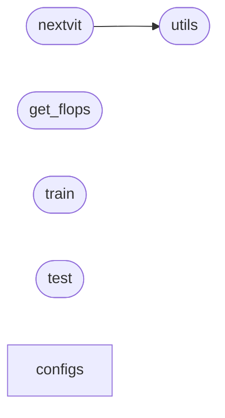

# Code Overview

[_Documentation generated by Documatic_](https://www.documatic.com)

<!---Documatic-section-Codebase Structure Python-start--->
## Codebase Structure Python

The codebase has a single-depth folder structure,
                with 12 code files in total.

<!---Documatic-block-system_architecture-start--->

<!---Documatic-block-system_architecture-end--->

# #
<!---Documatic-section-Codebase Structure Python-end--->

<!---Documatic-section-Important Functions-start--->
## Important Functions

<!---Documatic-block-important_funcs-start--->
<!---Documatic-block-most_used_funcs-start--->
### Most Utilised Functions

* [detection.utils.merge_pre_bn](3-detection_utils.md#detection.utils.merge_pre_bn) (1 times)
<!---Documatic-block-most_used_funcs-end--->
<!---Documatic-block-important_funcs-end--->

# #
<!---Documatic-section-Important Functions-end--->

<!---Documatic-section-Class Hierarchy-start--->
## Class Hierarchy

<!---Documatic-block-detection.nextvit.NextViT-start--->

	
<code>detection.nextvit.NextViT</code> (Click to Expand!)

* detection.nextvit.nextvit_base
* detection.nextvit.nextvit_large
* detection.nextvit.nextvit_small

<!---Documatic-block-detection.nextvit.NextViT-end--->

<!---Documatic-block-nn.Module-start--->

	
<code>nn.Module</code> (Click to Expand!)

* detection.nextvit.ConvBNReLU
* detection.nextvit.E_MHSA
* detection.nextvit.MHCA
* detection.nextvit.Mlp
* detection.nextvit.NCB
* detection.nextvit.NTB
* detection.nextvit.NextViT
* detection.nextvit.PatchEmbed

<!---Documatic-block-nn.Module-end--->

# #
<!---Documatic-section-Class Hierarchy-end--->

[_Documentation generated by Documatic_](https://www.documatic.com)